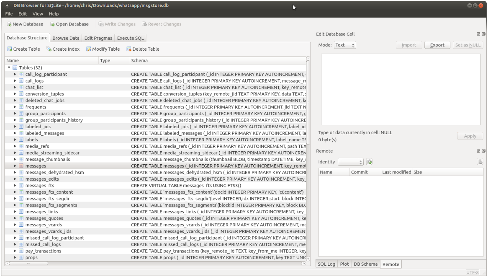
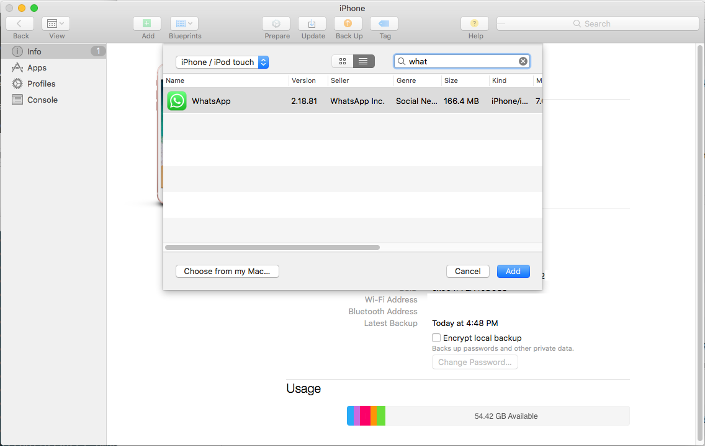
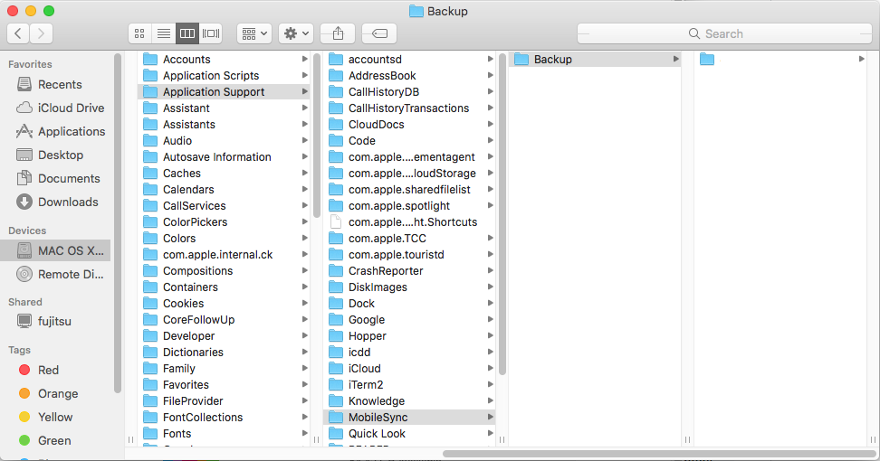
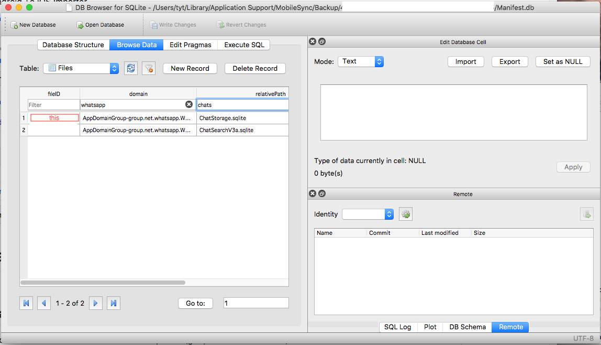

# Whatsapp Android To iOS Import Guide

Migrate Whatsapp chats history from Android to iOS.

## Forewords

If you are like me, who is skeptical of all those *paid* one click migration app that may or may not work, or worse, malicious, then you'd try it the hard way like me.

### Background

It is a shame that there is no official way to migrate between iOS and Android. That is, data is completely not portable. And theoretically the data is yours, but technically they are not yours (facebook ;).

It is rather ridiculous that even though your Whatsapp data is backed up on Google drive (or iCloud), they are encrypted by a key that is out of reach of your hand.

Whatsapp is constantly changing the algorithm of encrypting your chat database on Android, and that some reverse engineering is required to decrypt it by yourself because they never publish the details. So what works today, 2018, may not work next year or on next update.

The iOS side is a little bit easier, since encryption is being taken care by Apple (so...).

### Outline of this guide

1. extracting encryption key and database from Android; decrypt
2. convert to iOS format
3. restore on iOS

### Caveats of this guide

* Media files and shared locations are not imported (got placeholders instead)
* Messages from contacts that changed ids (phone numbers) are not linked

## Prerequisites

* Computer with Android platform tools
* PHP or java (for running decryption)
* Decrypted `msgstore.db` from Android (which means rooting your Android device)
* Mac with installed Xcode and iTunes (or use my binary if you do not mind)
* Installed and activated Whatsapp on your iDevice
* `Whatsapp.ipa` of the same version

## Step-by-step guide

### 1. extracting encryption key and database from Android; decrypt

This is probably the hardest part, if you have not already got a root phone. The methodology depends on the phone manufacturer, so I would not detail here. Just search on XDA. There must be a way. Once you have a rooted phone, the rest is pretty easy, so just run:

```
$ adb shell
android$ su
android# cp /data/data/com.whatsapp/files/key /sdcard
android# exit
android$ exit
```

Once the file has been copied to the SD card, use ADB again to copy the key and database to your computer.

```
$ adb pull /sdcard/key
$ adb pull /sdcard/WhatsApp/Databases/msgstore.db.crypt12
```

Note that crypt12 is different from crypt8 or crypt9.

Here, we have found a crypt12 decoder: [mgp25/Crypt12-Decryptor](https://github.com/mgp25/Crypt12-Decryptor).
You can also try other decryptors online. If you use PHP, just run:

```
php decrypt.php msgstore.db.crypt12 key
```

[reference](https://stackpointer.io/security/decrypt-whatsapp-crypt12-database-messages/559/) [reference](https://stackpointer.io/security/decrypt-whatsapp-crypt8-database-messages/419/)

Now, you should use a [sqlite browser](https://sqlitebrowser.org/) to see if the data is really yours!


### 2. convert to iOS format

* Check that Whatsapp is activated on iDevice. You should see the list of *group* chats
  when you open the app. Most likely, there won't be any messages prior to moving to iOS.
  You can even send/receive a message or two to be sure that there is something to back up.

* Install Apple Configurator 2 and obtain WhatsApp*.ipa by adding WhatsApp to your already-installed-WhatsApp iPhone.
You'll scrap from `~/Library/Group Containers/K36BKF7T3D.group.com.apple.configurator/Library/Caches/Assets/TemporaryItems/MobileApps/
`, replace the one on your phone to make sure they are the same version. [reference](https://apple.stackexchange.com/questions/298391/how-do-i-download-an-ios-app-ipa-file-to-my-mac-after-itunes-12-7-update )


* Build the migration utility (I'll assume `~/Downloads` folder), or use my binary. Mine was built using Xcode 9.0 Build version 9A235 on macOS 10.13

```
cd ~/Downloads
git clone https://github.com/residentsummer/watoi
cd watoi
xcodebuild -project watoi.xcodeproj -target watoi
```

* Create an unencrypted backup to local computer (not iCloud) with iTunes.
  Find the latest backup in `~/Library/Application Support/MobileSync/Backup`.


* Locate Whatsapp database file inside the backup and copy it somewhere:

      $ sqlite3 <backup>/Manifest.db "select fileID from Files where relativePath = 'ChatStorage.sqlite' and domain like '%whatsapp%';"
      abcdef01234567890
      $ cp <backup>/ab/abcdef01234567890 ~/Downloads/watoi/ChatStorage.sqlite
      
Or try the GUI way if your prefer. Here `abcdef01234567890` is just a place holder, yours will be different. Anyway, the file is located in the folder matching the first 2 characters of your file name.


* Extract the contents of `Whatsapp.ipa` (we'll need CoreData description files):

      cd ~/Downloads/watoi
      unzip ~/Downloads/WhatsApp_Messenger_x.y.z.ipa -d app

* Backup original database and run the migration:

      cp ChatStorage.sqlite ~/Documents/SafePlace/
      build/Release/watoi <path-to-msgstore.db> ChatStorage.sqlite app/Payload/WhatsApp.app/WhatsAppChat.momd

## 3. restore on iOS

* Replace database file inside the backup with the updated one:

      cp ChatStorage.sqlite "~/Library/Application Support/MobileSync/Backup/<backup>/ab/abcdef01234567890"

* Restore the backup with iTunes (not Configurator)

## Footnotes

[I](//github.com/tyt2y3) forked the original repository, added more details to the tutorial, and included a binary. Many thanks to the original [author](//github.com/residentsummer/watoi)!
